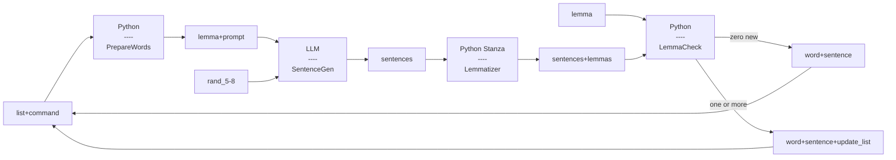
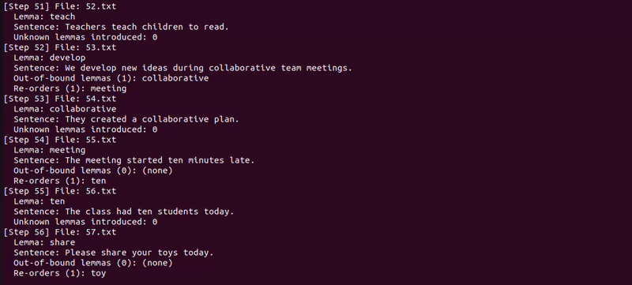

## Description

This CLI script generates n+1 sentences - sentences that introduce one new, unlearned word at a time - by adhering closely to frequency lists while allowing minor deviations to produce more natural-sounding sentences.

The script takes a list of unique lemmas (not words) ordered from most to least frequent, skips the first 500 lemmas and sends the first non previously processed lemma to an LLM that generates 10 different 5-8 word sentences that must include our working lemma.

A Stanza language model lemmatizes each generated sentences and the script picks the sentence with the least new words and adds it to the list, if the sentence picked introduces one or more new words other than our current one, that word is added to the list before the current one to maintain the n+1 rule and a sentence for the new word is created for it in the next loop, the duplicate is removed in case the newly introduced word is present further down the word list.

A consequence of the logic above is that the list gets modified in two ways during generation, some words further down the list are occasionally pushed up and some words from outside the list are occasionally added, I chose 10 sentence attempts per generation to strike a good balance between API costs and number of new word addition from outside the list, when testing one hundred steps with English, starting from lemma #501, less than 10 words from outside the list were added, giving a rate of adherence to the words in the list of 88%.

This adherence rate should go up as the process moves down the list and I using some percentage of less frequent words leads to more natural sounding sentences.

## Diagram

## Output

## Setup

`pip install torch --index-url https://download.pytorch.org/whl/cpu` #Installs CPU only version

`pip install stanza`

`pip install openai`

`export OPENAI_API_KEY="your_api_key_here"` #ENV variable

Add frequency list text file or extract included sample

## Usage

The script takes a numbered text file (1.txt, 2.txt, etc), a number of steps, and creates a new separated list file each time a new sentence entry is made, if a 100 step run ends with file 101.txt and that version gets approved, the next run should take 101.txt as an argument. The generated list seperates lemmas and their generated sentences by a tab character.

The script will print new file name, generated sentences, words that were pushed up from further down the list (r-orders) and words that were added from outside the list (out-of-bounds) on each step.

The script expects standard OpenAI structured outputs for API calls and uses a local Stanza lemmatizer. Stanza will attempt to download the chosen langauge's models on first run if not present.

**Arguments:**
- --steps (Number of steps to run)
- --file (Input list filename, e.g., 1.txt)
- --skip (Number of initial lemmas to skip, default: 500)
- --lang (Language code for Stanza, default: en)
- --model (OpenAI model name, default: gpt-5-mini)

**Test:**
`python lang_gen.py --steps 20 --file 1.txt --lang en --model gpt-5-mini`
