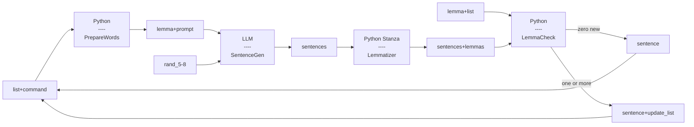

# **n+1 Sentence Generator**

## **Description**

This CLI tool generates **n+1 sentences** - sentences that introduce **one new, unlearned word at a time** - by using a frequency-based word list while allowing some deviation from the list for natural-sounding results.

### **What is n+1?**

The n+1 principle means that each new sentence should contain only one additional unknown word compared to the learner's current vocabulary.

### **Script Logic**

* Takes a **frequency list of lemmas** (base word forms), ordered from most to least frequent.
* Skips the first **500 lemmas**.
* For each new lemma:

  1. Sends the lemma to an LLM, which generates **10 sentences (5–8 words each)** containing that lemma.
  2. **Lemmatizes** the generated sentences using **Stanza**.
  3. Selects the sentence introducing the **fewest new lemmas**.
  4. If extra new words appear, they are **added to the list before the current lemma**, ensuring adherence to the n+1 rule.
  5. Updates the list and continues the process.

### **Why this approach?**

* Complete adherence to the frequency-based order while producing n+1 sentences can result in awkward sounding sentences.
* Generating 10 sentences that simply include our current word, filtering for the one with least new words and updating the list accordingly results in a high level of adherence (\~88% adherence to list in English after 100 steps) with relatively low API costs (~$0.20 / 100 steps for English with gpt-5-mini) without being overly strict or having to break the n+1 rule.

---

## **Process Diagram**



---


## **Setup**

Install dependencies:

```bash
pip install torch --index-url https://download.pytorch.org/whl/cpu   # CPU-only PyTorch
pip install stanza
pip install openai
```

Set your OpenAI API key:

```bash
export OPENAI_API_KEY="your_api_key_here"
```

Prepare a **frequency list** file (or extract the included 1.txt sample).

---

## **Usage**

The script:

* Takes a **numbered text file** (e.g., `1.txt`) and a **step count**.
* Creates a **new numbered file** each time a sentence is added.
* Example: If a 100-step run ends with `101.txt`, use that file for the next run.

Sentences and lemmas are separated by **tab characters** in the output files.

The script prints:

* New file name
* Generated sentences
* Words reordered from further down the laist (`r-orders`)
* Words added from outside the list (`out-of-bounds`)

Stanza will download the required language model on first run if not already installed.

---

### **Command Example**

```bash
python lang_gen.py --steps 20 --file 1.txt --lang en --model gpt-5-mini
```

---

## **Arguments**

| Argument  | Description                         | Default    |
| --------- | ----------------------------------- | ---------- |
| `--steps` | Number of steps to run              | —          |
| `--file`  | Input list filename (e.g., `1.txt`) | —          |
| `--skip`  | Number of initial lemmas to skip    | 500        |
| `--lang`  | Stanza language code                | en         |
| `--model` | OpenAI model name                   | gpt-5-mini |

---

## **Example CLI Output**

```
[Step 60] File: 61.txt
Lemma: skill
Sentence: He learned a new skill last summer.
Unknown lemmas introduced: 0

[Step 61] File: 62.txt
Lemma: carry
Sentence: Please carry the heavy box to the car.
Out-of-bound lemmas (0): (none)
Re-orders (2): heavy, box

[Step 62] File: 63.txt
Lemma: heavy
Sentence: His heavy coat kept him warm today.
Out-of-bound lemmas (0): (none)
Re-orders (2): coat, warm

[Step 63] File: 64.txt
Lemma: coat
Sentence: He bought a new coat yesterday.
Out-of-bound lemmas (0): (none)
Re-orders (1): yesterday

[Step 64] File: 65.txt
Lemma: yesterday
Sentence: He left town yesterday for business.
Unknown lemmas introduced: 0
```

---

## **Notes**

* Expects **standard OpenAI structured outputs**.
* Uses **local Stanza lemmatizer** for word analysis.
* Language models and frequency lists should match the target language.